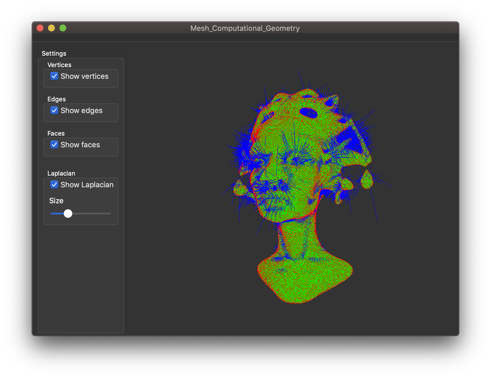
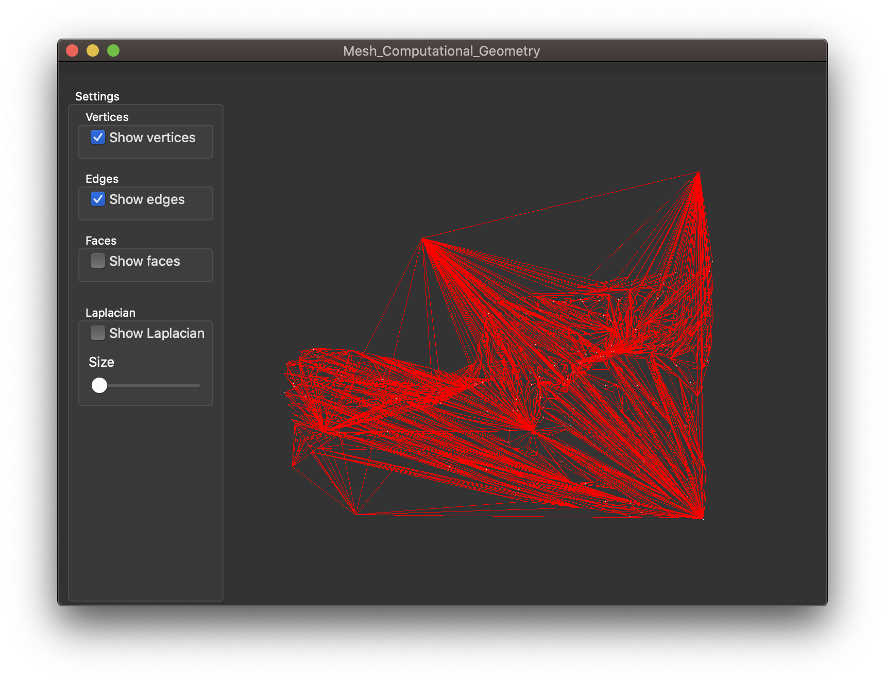
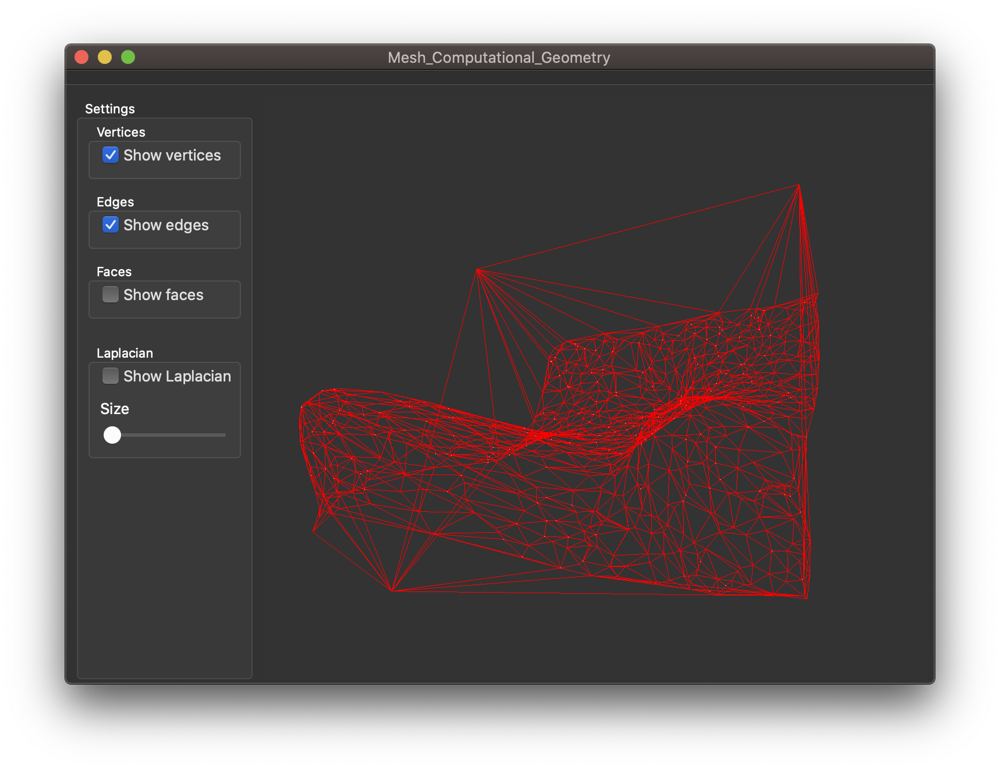

# Mesh Computationnal Geometry

## Usage

Charger ```Mesh_Computationnal_Geometry.pro``` dans [Qt Creator](https://www.qt.io).

Si vous êtes sur MacOS, commenter les lignes 27 et 28 du fichier ```Mesh_Computationnal_Geometry.pro```.

```c++
#---- Comment the following line on MacOS
#LIBS += -lglu32
#LIBS += -lOpengl32
```

### 1. Analyse d'une surface refermée sur elle même : espace convexe.

Exemple : ```queen.off```, ```cube.off```, ...


Compléter la ligne 59 et 60 du fichier ```gldisplaywidget.cpp```:    

```c++
// Construction of the mesh before it is displayed
// Replace the values of the following two variables with
// the path to the off-file of your choice
// --------------------------------------------------------------------------------------
char path_to_off_files[512] = "/path/to/directory/Mesh_Computationnal_Geometry/off_files/";
char off_filename[64] = "your_off_file.off";
// --------------------------------------------------------------------------------------
```

Compléter les lignes 68 à 77 du fichier ```gldisplaywidget.cpp```, de manière à lancer uniquement ```parsefile```, ```sew``` et ```computeLaplacian``` :

```c++
// Construction of the mesh before it is displayed
_mesh.parseFile(path_to_off_file);
_mesh.sew();

//Choose which action to apply to the selected file.
// --------------------------------------------------------------------------------------
_mesh.computeLaplacian();
//_mesh.naiveInsertion();
//_mesh.naiveInsertionAndLawson();
// --------------------------------------------------------------------------------------
```

Vous pourrez alors, sur la fenêtre obtenue, afficher les points, les arêtes, les faces et le laplacien. Vous pourrez régler la taille de ce dernier à l'aide du curseur.

Voici le rendu obtenu avec le fichier ```queen.off```.



### 2. Analyse d'une surface non refermée : type relief

Exemple de fichier : ```franke4.off```, ```franke5.off```, ...

- On travaille en supposant que le relief apparait sur la dimension ```z```. Ainsi, les calculs tels que les tests d'appartenance à un triangle, les tests d'orientation, etc... se font en ne tenant pas compte de la dimension ```z```.
- Pour ces surfaces, on ne peut pas afficher le laplacien car la surface n'est pas fermée.
- Lors du lancement d'une des fonctions ```naiveInsertion``` OU ```naiveInsertionAndLawson```, on commence par créer un cadre (2 triangles rectangles d'hypothénuse commune) qui contiendront ensuite tous les points.

#### Triangulation simpliste :

Compléter les lignes 68 à 77 du fichier ```gldisplaywidget.cpp```, de manière à lancer uniquement ```parsefile```, ```sew``` et ```naiveInsertion``` :

```c++
// Construction of the mesh before it is displayed
_mesh.parseFile(path_to_off_file);
_mesh.sew();

//Choose which action to apply to the selected file.
// --------------------------------------------------------------------------------------
//_mesh.computeLaplacian();
_mesh.naiveInsertion();
//_mesh.naiveInsertionAndLawson();
// --------------------------------------------------------------------------------------
```

On obtient la triangulation naive dans la fenêtre. On pourra afficher les points, les arêtes et les faces, mais __pas le laplacien ici__.

Voici le rendu obtenu avec le fichier ```franke4.off```.



#### Triangulation de Delaunay :

Compléter les lignes 68 à 77 du fichier ```gldisplaywidget.cpp```, de manière à lancer uniquement ```parsefile```, ```sew``` et ```naiveInsertionAndLawson``` :

```c++
// Construction of the mesh before it is displayed
// Construction of the mesh before it is displayed
_mesh.parseFile(path_to_off_file);
_mesh.sew();

//Choose which action to apply to the selected file.
// --------------------------------------------------------------------------------------
//_mesh.computeLaplacian();
//_mesh.naiveInsertion();
_mesh.naiveInsertionAndLawson();
// --------------------------------------------------------------------------------------
```

On obtient la triangulation optimale dans la fenêtre. Toutes les arêtes, sauf celles sur les bords, sont de Delaunay. On pourra afficher les points, les arêtes et les faces (ne pas toucher aux boutons relatifs au laplacien).



