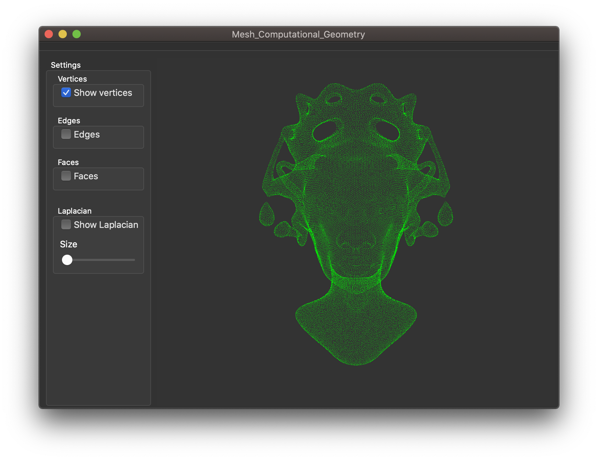

# Mesh Computationnal Geometry

## Usage

Charger ```Mesh_Computationnal_Geometry.pro``` dans [Qt Creator](https://www.qt.io).

Si vous êtes sur MacOS, commenter les lignes 27 et 28 du fichier ```Mesh_Computationnal_Geometry.pro```.

```
#---- Comment the following line on MacOS
#LIBS += -lglu32
#LIBS += -lOpengl32
```

Ensuite, compléter la ligne 45 et 46 du fichier ```gldisplaywidget.cpp```:    

```c++
// Construction of the mesh before it is displayed
char path_to_off_files[512]="/path/to/directory/Mesh_Computationnal_Geometry/off_files/";
char off_filename[64]="your_off_file.off";
```

Voici le rendu obtenu avec le fichier ```queen.off```.


